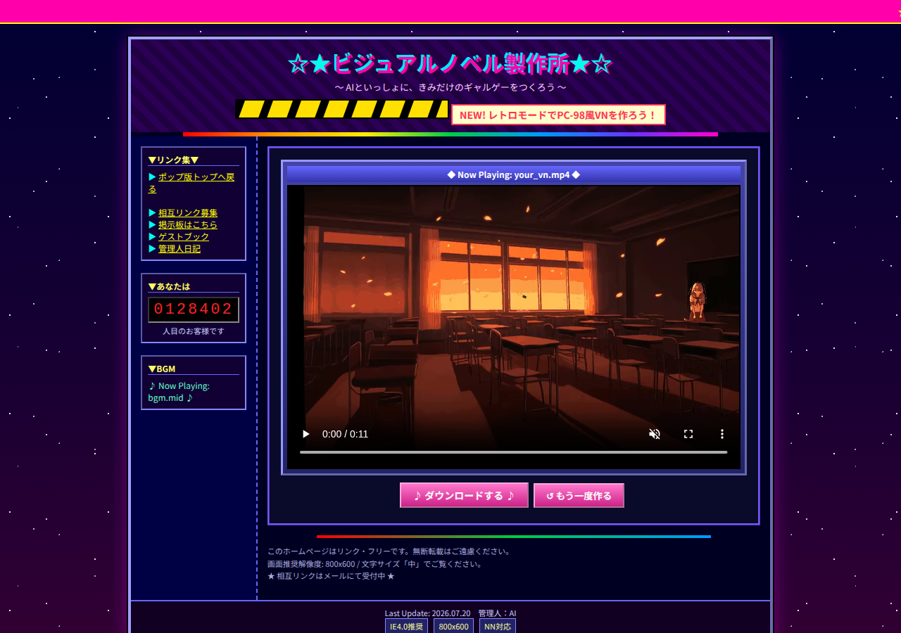

# VN Creator



Generates short visual-novel-style scenes (a few seconds each) end-to-end from
a text description: a scene director (Claude) writes the shot, then a chain
of local models turn it into a video — a unified character+background
illustration, Japanese voice, background music, and a typewriter-timed
textbox — muxed into one `.mp4`.

Two output styles:

- **Default** — a modern anime illustration (Illustrious-XL, SDXL) rendered
  as a static shot with a subtle Ken Burns pan/zoom.
- **Retro** — a PC-98 (`PC-9801`) pastiche: 640x400 output, a palette
  quantize/dither filter, a PC-98-style LoRA, FM-synth-flavored BGM, no voice
  (many early-90s titles had none), and a choice of textbox styles including
  a Leaf/Kizuato-style full-screen NVL mode.

## Pipeline

```
Scene Director (Claude, structured tool-call)
  -> dialogue, emotion, timing, BGM mood, illustration prompt, camera move
        |
        +--> TTS (Style-Bert-VITS2, JP-Extra)         -> voice.wav
        +--> BGM (MusicGen)                            -> bgm.wav
        +--> Illustration (Illustrious-XL, SDXL)        -> scene.png
                 |
                 v
        Ken Burns render + textbox overlay + audio mix  -> scene.mp4
```

Character and background are always generated together as **one** image
(never as separate layers composited afterward) — this is what keeps them
visually coherent (matching art style, lighting, perspective) instead of
looking like a cardboard cutout pasted over a background.

An older path still exists for a caller-supplied character/background still:
in that case the character is animated with SadTalker (lip-sync) and
composited over the separately-generated background. This is off by default
(see [Known limitations](#known-limitations)) — the default flow uses the
static-illustration render above.

## Project layout

```
scripts/run_scene.py            CLI entry point / orchestrator
src/vn_creator/
  config.py                     paths, env, GPU pinning
  director/                     Claude scene-script generation (schema.py, generate.py)
  tts/synth.py                  Style-Bert-VITS2 Japanese voice synthesis
  illustration/
    generate.py                 Illustrious-XL unified character+background generation
    lora_merge.py               manual kohya LoRA merging (text encoders only)
    retro_filter.py             palette quantize/dither for the PC-98 look
  character/generate.py         Animagine XL 4.0 — legacy character-only / background-only generation
  animate/talking_head.py       SadTalker wrapper (legacy path only)
  bgm/generate.py                MusicGen background music
  render/
    illustration_shot.py        Ken Burns + textbox + audio mix -> final mp4 (default path)
    compose.py                   legacy compositor for separately-supplied character/background
    textbox.py                   pluggable textbox styles (default / leaf_nvl / ddlc)
  webapp/                       FastAPI web UI (server.py + static/)
```

Large artifacts (model weights, caches, generated outputs) should live outside
the repo and are resolved from `VN_DATA_ROOT`. Pick a writable location with
enough disk space, for example `$PWD/.vn-data` for a local checkout or a
shared data volume on a GPU host. Third-party checkouts such as SadTalker and
libvgm should live under `$VN_DATA_ROOT/third_party`.

## Setup

```bash
python -m venv .venv
source .venv/bin/activate
pip install -r requirements.txt
export VN_DATA_ROOT="${VN_DATA_ROOT:-$PWD/.vn-data}"
```

Secrets go in a git-ignored `.env` in the repo root:

```
ANTHROPIC_API_KEY=sk-ant-...
```

Place model weights under `$VN_DATA_ROOT/models`: Style-Bert-VITS2
(jvnv-F1-jp), Illustrious-XL v2.0 + sdxl-vae-fp16-fix, the PC-98 style LoRA,
Animagine XL 4.0 (legacy character path), and MusicGen (via the
`transformers` cache). SadTalker checkpoints and any local SadTalker checkout
should live under `$VN_DATA_ROOT/third_party/SadTalker` when using the legacy
animation path.

GPU: set `CUDA_VISIBLE_DEVICES` before running if you need to select a specific
GPU. On a single-GPU machine, `CUDA_VISIBLE_DEVICES=0` is usually appropriate.

## Usage

### CLI

```bash
python scripts/run_scene.py \
  --character-name "ヒロイン" \
  --character-description "長い銀髪、青い目、清楚な女子高生、セーラー服" \
  --background-description "夕暮れの誰もいない教室、桜の木が窓の外に見える" \
  --persona "普段は強気だが、恋愛には不器用。主人公のことが好きだが素直に言えない。" \
  --context "卒業式の後、二人きりで教室に残っている。" \
  --genre "青春恋愛、切ない" \
  --out "$VN_DATA_ROOT/outputs/scene.mp4"
```

Add `--retro-style` for the PC-98 look. `--text-style {default,leaf_nvl,ddlc}`
picks the textbox style (defaults to `leaf_nvl` automatically when
`--retro-style` is set). `--character-image`/`--background-image` opt into
the legacy separate-layer + SadTalker path instead of unified generation.

Individual stages are also runnable standalone for testing, e.g.
`python -m vn_creator.illustration.generate --prompt "..." --retro`,
`python -m vn_creator.tts.synth --text "..." --emotion "..."`,
`python -m vn_creator.render.illustration_shot --scene-json ... --illustration ...`.

### Web UI

```bash
source .venv/bin/activate
python -m uvicorn vn_creator.webapp.server:app --host 0.0.0.0 --port 8420 --app-dir src
```

- `/` — a bright "pop"-styled form (character/background/persona/context/genre
  + a retro toggle). Flipping the retro toggle jumps to `/retro` immediately,
  carrying over whatever's already typed.
- `/retro` — a 90s-Japanese-personal-homepage-styled page with its own copy of
  the form; submitting here always generates in retro mode.

Jobs run as a background `run_scene.py` subprocess, one at a time (the
pipeline is GPU-heavy, so no concurrency), tracked in-memory by the server
and polled by the frontend via `/api/status/{job_id}`.

## Known limitations

- **No character animation by default.** SadTalker's face detector (a
  real-face RetinaFace model) is unreliable enough on anime art that it was
  disabled for the default path as a deliberate simplification — the static
  illustration alone is the current first step. It still exists for the
  legacy caller-supplied-image path (with a static-shot fallback if
  detection fails), patched with a much lower confidence threshold
  (`0.01` instead of the stock `0.97`) to work at all on anime faces.
- **CLIP's 77-token limit** silently truncates long illustration prompts —
  the Director sometimes writes prompts long enough to lose trailing
  descriptive tags. Cosmetic, not a correctness bug.
- **The Director occasionally emits invalid structured output** (e.g. `bgm`
  as a plain string instead of an object) or ignores a forced `shot_type`;
  `generate_scene()` retries with corrective feedback, and `retro_style`
  behavior no longer depends on the Director's shot_type compliance.
- **PC-98 BGM is MusicGen-prompted, not chip-emulated.** An actual
  YM2608/OPNA register-level synthesis path was scoped and partially
  prototyped (`libvgm`/`vgm2wav` built and working in `third_party/`) but
  MusicGen with FM-synthesis-flavored prompts turned out to be good enough
  for now.
